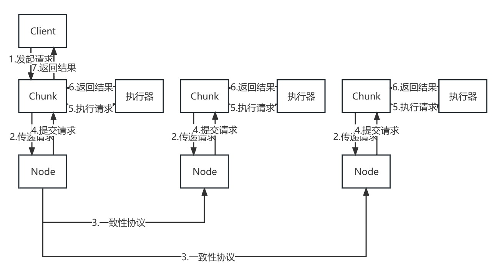

# crfs
基于craq和hdfs改写的分布式文件系统

## Task 1 实现craq服务

### Task 1-1 实现链表配置的动态更新

#### 要求

1.  当节点与zookeeper集群之间没有连接时，不断尝试与zookeeper集群建立连接。
2.  建立连接成功后，节点向zookeeper集群创建一个临时文件，存储节点的地址。
3.  其他在该路径下创建临时文件的节点与当前节点共同构成一个链表，节点在链表中的顺序由文件名的大小决定。
4.  创建文件成功后，从zookeeper集群读取同一文件夹的所有文件名，对文件名进行排序，得到链表的节点顺序，找到当前节点在链表中的位置，找到节点的前驱、后继和尾节点。
5.  从zookeeper集群读取前驱、后继和尾节点的地址。
6.  存储第3步和第4步获取的链表信息。
7.  监听第3步读取的文件夹的变化。

#### 提示

- 需要实现的代码：crfs/node/node.go中的watchChain的2,3,4,5,6。
- 需要阅读的代码：crfs/node/node.go, crfs/zk/zk.go。
- 第2步在创建文件时需要同时指定zk.FlagEphemeral和zk.FlagSequence标志，节点路径为chainPath + "/" + prefix
- 第3步和第4步要向zookeeper集群发送多个请求，因此必须所有的请求都执行成功，才能更新本地的链表信息。
- 第5步在更新链表信息时需要加锁。
- 第6步可以借助watch机制实现，即在第3步调用zkConn.Children时将watch指定为true，然后在完成第5步后，阻塞读取zkConn.Children返回的watcher。

#### 测试

在crfs/node路径下执行go test -run TestChain命令，以下输出表示通过测试：

```shell
Test (Chain): basic chain test ...
  ... Passed --   1.0    50    8312    0
Test (Chain): varied chain test ...
  ... Passed --   6.1   185   30559    0
Test (Chain): test chain varied more ...
  ... Passed --  15.6   865  142117    0
PASS
ok      crfs/node       22.655s
```

每个测试下的4个数字分别表示运行时长，rpc总数，rpc传输的字节总数和提交的日志数。

### Task 1-2 实现一致性协议

#### 要求
(1)实现日志的复制
流程概述：对于每一个节点，记录后继节点的名称和最新完成复制的日志索引，当后继节点的日志记录落后当前节点的日志记录时，将所有新日志发送给后继节点。
注意：每当后继节点变化时，都应当重新向后继节点查询已完成复制的最新索引日志。复制日志成功时也要更新该索引值。
提示：首先，补全kickOffCopy函数中的步骤1和步骤2。然后，根据注释实现QueryLastIndex和SendLogs函数。
(2)实现日志的提交
流程概述：对于尾节点，可以直接在本地提交日志。但有两个前提条件，首先尾节点要从zookeeper中获取到提交锁，其次，尾节点在更新本地的commitIndex之前，要先将新的commitIndex更新到zookeeper中。
提示：补全kickOffCommit函数中的步骤2.1-4。
(3)实现日志的确认
流程概述：对于每一个节点，记录前驱节点的名称和最新确认的日志索引，当节点提交新的日志时，向前驱节点发送确认消息，让前驱节点提交新的日志。
注意：每当前驱节点变化时，都应当重新向前驱节点查询已提交的最新日志索引。确认成功时也要更新该索引值。
提示：首先，补全kickOffAck函数中的步骤1和步骤2。然后，根据注释实现Ack。
(4)实现日志的执行
流程概述：每当有日志提交时，自增node.lastApplied，然后将索引为node.lastApplied的日志发送到node.applyCh中。
提示：补全kickOffApply函数的步骤1和步骤2。

#### 测试
在crfs/node路径下执行go test -run TestAgreement命令，以下输出表示通过测试：
```shell
Test (Agreement): basic agreement test ...
  ... Passed --   1.2    75   12468    3
Test (Agreement): concurrent agreement test ...
  ... Passed --   1.4    66   11492   30
Test (Agreement): agreement test with crash and restart ...
  ... Passed --   9.1   514   85243   40
Test (Agreement): agreement test with disconnect ...
  ... Passed --   3.6   192   31713   20
Test (Agreement): agreement test where committed node crashed ...
  ... Passed --   5.1   171   28488   30
Test (Agreement): agreement test with header partition ...
  ... Passed --   1.6   104   16599    3
Test (Agreement): agreement test with tail partition ...
  ... Passed --   3.6   123   19709    3
Test (Agreement): concurrent agreement test (unrealiable) ...
  ... Passed --   3.8   133   23977  160
PASS
ok      crfs/node       29.435s
```

### Task 1-3 实现持久化

#### 要求
1.每当节点提交日志时，将最新提交的日志索引和所有提交的日志持久化。
2.节点启动时，读取持久化的日志索引和所有提交的日志。

#### 提示
1.根据注释补全persist和readPersist函数。
2.找到所有更新node.CommitIndex的代码(不包括初始化)，在更新之后调用persist函数持久化node的状态。

#### 测试
在crfs/node路径下执行go test -run TestPersistence命令，以下输出表示通过测试：
```shell
Test (Persistence): test basic persistence ...
  ... Passed --   3.8   208   33451   10
Test (Persistence): test more persistence ...
  ... Passed --  16.1  1130  186844    9
Test (Persistence): test persistence (unreliable) ...
  ... Passed --   6.2   342   51529   20
PASS
ok      crfs/node       26.176s
```

## Task 2 实现chunk服务器

### 功能介绍

在每一台服务器上，分别启动chunk进程和node进程。chunk进程负责处理客户端发送的块读写请求，并将请求的内容发送给node进程。node完成一致性协议后会通过applyCh信道提交相应的请求，chunk进程需要监听这个信道，每当有新提交的请求，就将请求从信道中取出，并交给本地的执行器执行。执行器执行完后chunk进程将执行结果返回给客户端。架构如下：



### 要求

实现客户端操作和执行器。

客户端操作，即Write、Append、Read，用一个客户端编号ClerkId和一个请求编号RequestId唯一标识，对于同一个客户端，请求编号从1开始递增。delete是内部操作，无需标识。

1. 实现Write的rpc服务，实现流程如下：
   1. 收到客户端的rpc请求，检查resultMap[ClerkId]返回结果中的RequestId是否等于Write操作的RequestId，如果等于，表明执行器执行完该请求，将该结果返回给客户端。
   2. 将Write操作封装成Op对象，调用node.Start(op)开始一致性协议。
   3. 如果Start返回false，则直接返回persister.WrongHead错误，表明该服务器不是头节点，不能开始一致性协议。
   4. 进入无限循环，不断检查resultMap[ClerkId]返回结果中的RequestId是否等于Write操作的RequestId，如果等于，表明执行器执行完该请求，将该结果返回给客户端，退出循环。
2. 实现Append的rpc服务，实现流程与Write一致。
3. 实现Read的rpc服务，实现流程如下：
   1. 收到客户端的rpc请求，检查resultMap[ClerkId]返回结果中的RequestId是否等于Get操作的RequestId，如果等于，表明执行器执行完该请求，将该结果返回给客户端。
   2. 调用node.LastCommittedIndex获取当前zookeeper提交的日志索引。
   3. 进入无限循环，如果cs.lastApplied >= lastCommittedIndex，将Read操作添加到相应chunk的任务队列的末尾，退出循环。
   4. 进入无限循环，不断检查resultMap[ClerkId]返回结果中的RequestId是否等于Get操作的RequestId，如果等于，表明执行器执行完该请求，将该结果返回给客户端，退出循环。
4. 实现本地的delete函数，实现流程如下：
   1. 将delete操作封装成Op对象，调用node.Start(op)开始一致性协议。
   2. 如果Start返回false，则直接返回persister.WrongHead错误，表明该服务器不是头节点，不能开始一致性协议。
   3. 进入无限循环，如果cs.lastApplied >= index（Start函数的返回值），则返回persister.Success。
5. 实现任务队列，实现流程如下：
   - chunk服务器从node收到提交的更新操作，即Write、Append和delete操作后，将该操作添加到相应chunk的任务队列的末尾，由单独的线程按顺序执行任务队列中的操作。
   - 每个chunk有一个执行线程，负责循环读取任务队列中首个操作，然后调用persister相应的文件读写函数，如persister.Write()。执行完毕后更新resultMap[ClerkId]。

### 提示

- 补全ChunkServer.Write的步骤1-4。
- 补全ChunkServer.Append的步骤1-4。
- 补全ChunkServer.Read的步骤1-4。
- 补全ChunkServer.delete的步骤1-3。
- 补全ChunkServer.apply的步骤1。

### 测试

在crfs/node路径下执行go test命令，以下输出表示通过测试：

```shell
Test: one client ...
 ... Passed --  7.7   3  1355  149
Test: many clients ...
 ... Passed --  14.2  3  4324  669
Test: unreliable net, many clients ...
 ... Passed --  12.7  3  1829  222
Test: concurrent append to same chunk, unreliable ...
 ... Passed --  3.1   3  683   101
Test: restarts, one client ...
 ... Passed --  25.8  3  1768  168
Test: restarts, many clients ...
 ... Passed --  38.1  3  4461  651
Test: unreliable net, restarts, many clients ...
 ... Passed --  31.8  3  2324  204
PASS
ok    crfs/chunkserver     133.548s  
```

## Task 3 实现crfs

### 功能介绍

- 实现master。master的功能如下：
  - 维护文件目录结构树，负责文件元信息的操作，如文件的创建、删除、移动等。
  - 维护文件与chunk之间的映射，文件会被拆分成64MB为单位的chunk，当client执行write或append操作时，如果写入范围超出了当前文件范围，需要为文件创建新的chunk。
  - 客户端执行write、append或read操作时，根据client写入或读取指定的范围返回对应的chunk name和存储chunk的chunk server列表，即链表中的服务器地址。
- 实现client。client的功能如下：
  - 执行文件元信息相关的操作，请求master，并将结果返回给用户。
  - 执行文件的读写操作，首先请求master获取chunk相关的信息，然后向对应的chunk servers发送读写chunk的命令，写入成功后向master发送ack消息更新文件的元信息，最后将结果返回给用户。

### 要求

实现client。

1. Create、Delete、Restore、Move、List，直接进行rpc调用即可，`c.masterClient.Call("Master.Create", &args, &reply)`。
2. Write，实现流程如下：
   1. 根据offset和data的大小计算需要写入的chunk索引范围，如，`offset == 0`，`len(data) == persister.MaxChunkSize`，由于写入范围在chunk 0中，因此范围是`[0, 0]`。如果`offset == 1`，则写入范围是`[0, 1]`，需要依次将数据写入到chunk 0和chunk 1中。
   2. 向master发送`Master.Write`请求，获取待写入的chunk names和chunk servers地址。
   3. 按照chunk索引顺序将数据写入相应的chunk servers中。
   4. 写入成功后，向master发送`Master.Ack`请求，其中`pointer = offset + len(data)`，表示写入完成时指针的位置。
   5. 返回执行成功。
3. Append，实现流程如下：
   1. 向master发送`Master.Append`请求，获取待追加的chunk name和chunk servers地址。
   2. 将数据追加到chunk servers中。
   3. 如果chunk servers返回persister.OutOfChunk错误，更新`fullChunkIndex = appendReply.ChunkIndex`，并返回步骤1。
   4. 追加成功后，向master发送`Master.Ack`请求，其中`pointer = offset + len(data)`，表示写入完成时指针的位置。
   5. 返回执行成功。
4. Read，实现流程如下：
   1. 根据offset和data的大小计算需要读取的chunk索引范围。
   2. 向master发送`Master.Read`请求，获取待写入的chunk names和chunk servers地址。
   3. 按照chunk索引顺序依次读取数据。
   4. 返回执行结果。

### 提示

补全crfs/client/Client.go

### 测试

在crfs/test路径下执行go test命令，以下输出表示通过测试：

```shell
Test: one client ...
  ... Passed --   6.2  3  1301  148
Test: many clients ...
  ... Passed --   6.4  3  4298  665
Test: unreliable net, many clients ...
  ... Passed --  10.1  3  1674  162
Test: concurrent append to same file, unreliable ...
  ... Passed --   4.1  3  1099  101
Test: restarts, one client ...
  ... Passed --  24.7  3  2203  175
Test: restarts, many clients ...
  ... Passed --  25.7  3  2722  290
Test: unreliable net, restarts, many clients ...
  ... Passed --  33.9  3  2846  162
PASS
ok      crfs/test       111.307s
```

### 使用说明

1. 进入crfs目录，执行`docker compose up`。
2. 容器启动完成后，执行`docker exec -it crfs-client-1 /bin/sh`。
3. 执行`./client -master=master:9999 -zookeeper=zoo1 -zookeeper=zoo2 -zookeeper=zoo3`进入交互界面，执行help查看命令，执行exit退出交互界面。